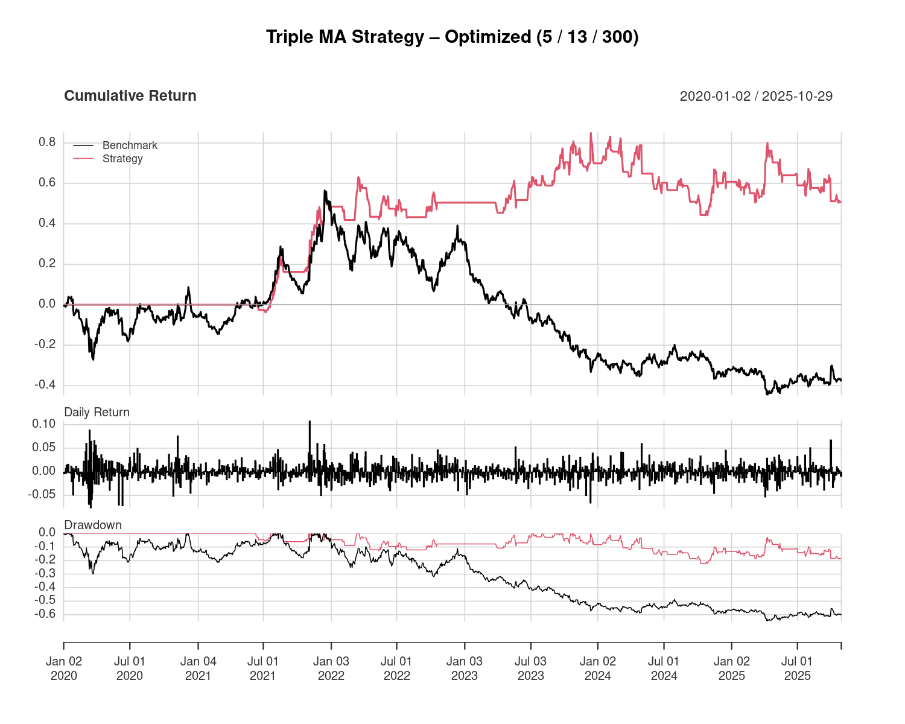
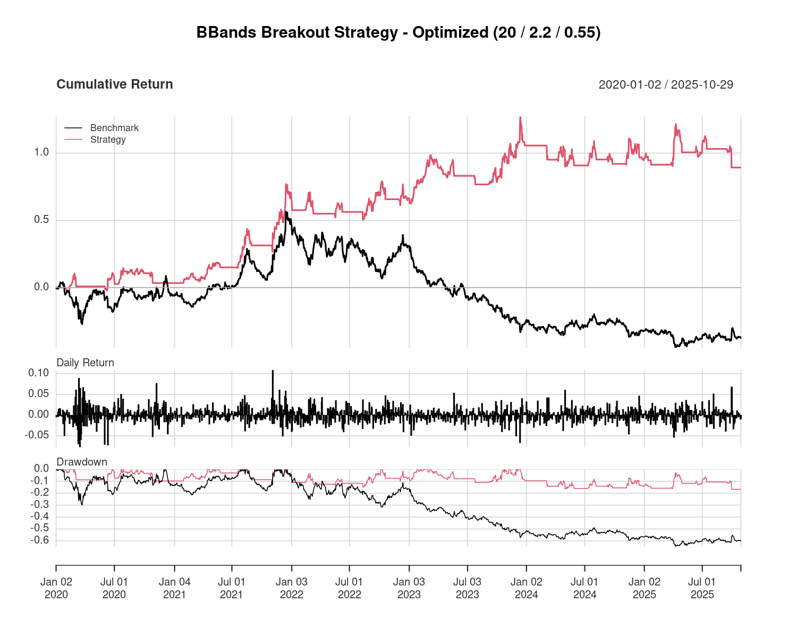

# Case Studies 

This section contains practical applications of systematic trading strategies
across different markets, with the aim of evaluating, optimizing,
and discussing their empirical performance.

## PFE Case Study — Pfizer Inc.

This case study analyzes the performance of systematic trading strategies applied to Pfizer Inc. (PFE) over the period 2020–2025, a timeframe characterized by elevated volatility, regime shifts, and strong idiosyncratic market narratives.

The objective is twofold:
assess the robustness of different systematic approaches under stress conditions
compare their effectiveness relative to a buy-and-hold benchmark

### Strategies Overview
The following strategies were implemented and evaluated:

 - **Triple Moving Average Strategy (Optimized)**
   Trend-following framework based on a fast–mid–slow MA structure, optimized to balance responsiveness and noise filtering.
 - **Bollinger Bands Mean-Reversion Strategy (Optimized)**
   Volatility-based strategy designed to exploit short-term price deviations from statistical equilibrium.

Each strategy underwent parameter optimization and was tested on the same dataset to ensure comparability.

### Price Dynamics & Signal Structure

  
  

The charts illustrate how each strategy interacts with price dynamics:

- **Triple Moving Average**: captures trend persistence through regime filtering and sustained directional exposure.
- **Bollinger Bands**: exploits volatility expansion and contraction by identifying statistically extreme price movements.

---

### Backtest Performance Comparison

  
  

Both strategies demonstrate resilience during benchmark drawdowns and improved risk-adjusted performance compared to buy-and-hold, while exhibiting distinct behavioral profiles across different market regimes.

